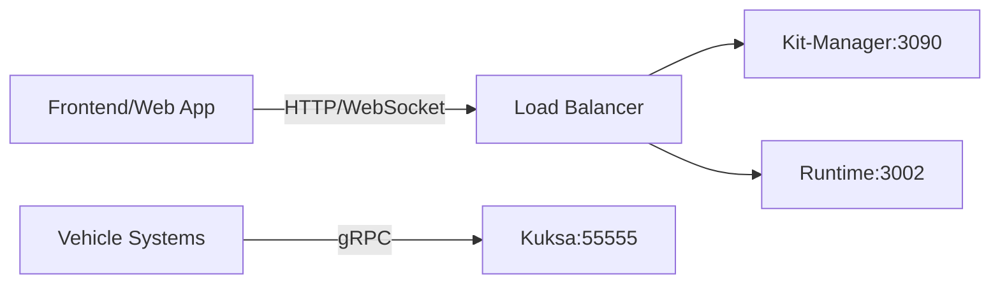
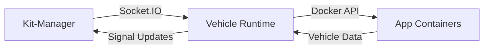

# Docker Black Box Analysis: Communication Architecture

## 🐳 Container Architecture (3 Deployment Models)

### 1. Separate Containers (Production)
```
┌─────────────────┐    ┌─────────────────┐    ┌─────────────────┐
│   Kit-Manager   │    │ Vehicle Edge    │    │  App Containers │
│   Container     │◄──►│   Runtime       │◄──►│  (Python/Binary)│
│   Port: 3090    │    │   Container     │    │   (Dynamic)     │
└─────────────────┘    │   Port: 3002    │    └─────────────────┘
                       │   Port: 3003    │
                       └─────────────────┘
```

### 2. Combined Container (Development)
```
┌─────────────────────────────────────────┐
│           Combined Container           │
│  ┌─────────────┐  ┌─────────────────┐  │
│  │ Kit-Manager │  │ Vehicle Edge    │  │
│  │   Port 3090 │◄─│ Runtime Port    │  │
│  └─────────────┘  │ 3002/3003       │  │
│                   └─────────────────┘  │
│           ◄─────── App Containers ───────┘
└─────────────────────────────────────────┘
```

## 🌐 Communication Protocols & Ports

| **Service** | **Port** | **Protocol** | **Purpose** | **Who Connects** |
|-------------|----------|--------------|-------------|------------------|
| **Kit-Manager** | 3090 | HTTP/WebSocket | REST API + Socket.IO | Frontend, Runtime |
| **Vehicle Runtime** | 3002 | WebSocket | Application API | Frontend, Apps |
| **Health Check** | 3003 | HTTP | Health monitoring | Load balancers |
| **Kuksa Integration** | 55555 | gRPC/WebSocket | Vehicle signals | Runtime (external) |
| **Redis** | 6379 | TCP | Session storage | Kit-Manager (dev) |

## 🔄 Communication Flows

### External → System


### Inter-Container Communication


## 🎯 Current Communication Support

### ✅ WebSocket Commands Supported

#### Application Management
```javascript
- register_kit           // Register runtime with Kit-Manager
- run_python_app         // Execute Python code in containers
- run_binary_app         // Execute binary applications
- stop_app               // Stop running applications
- get_app_status         // Get application status
- console_subscribe      // Real-time output streaming
```

#### Vehicle Signal Management (Phase 2)
```javascript
- subscribe_apis         // Subscribe to vehicle signals
- write_signals_value    // Set vehicle signal values
- get_signals_value      // Get current signal values
- generate_vehicle_model // Create custom VSS models
- list_mock_signal       // List available signals
- set_mock_signals       // Set test signal values
```

#### System Management
```javascript
- report-runtime-state   // Runtime status and metrics
- ping                   // Health check
```

### ✅ Docker-in-Docker Pattern
- **Runtime containers spawn app containers** (Docker-in-Docker)
- **Volume mounting**: `/var/run/docker.sock` for container management
- **Data persistence**: `./data` directory mounted for logs, configs, apps
- **Network isolation**: `vehicle-edge-network` bridge network

### ✅ Service Discovery
- **Kit-Manager URL**: `ws://kit-manager:3090` (container name resolution)
- **Health checks**: Built-in container health monitoring
- **Depends-on**: Runtime waits for Kit-Manager healthiness

## 🔧 What's "Wired" vs "What's Magic"

### 🔌 Wired (Explicit Connections)
- **Port mappings**: 3002, 3003, 3090 exposed to host
- **Volume mounts**: Data persistence, Docker socket access
- **Environment variables**: Service URLs, configuration
- **Network configuration**: Bridge network with service discovery
- **Health checks**: Container monitoring and restart policies

### ✨ Magic (Abstracted Away)
- **Container orchestration**: Docker Compose handles startup order
- **Service discovery**: Container names resolve to IPs
- **Signal simulation**: Kuksa integration creates realistic vehicle data
- **Credential injection**: Vehicle tokens auto-injected into app environments
- **Dynamic port allocation**: App containers get isolated networks

## 🌍 External Integrations

| **External System** | **Integration Method** | **Data Flow** |
|-------------------|------------------------|---------------|
| **Vehicle Systems** | Kuksa databroker (gRPC) | Real-time vehicle signals |
| **Frontend Apps** | WebSocket/HTTP API | User interface communication |
| **External APIs** | HTTP requests from app containers | Third-party service integration |
| **File System** | Volume mounts | Persistent data storage |

## 🚀 Deployment Options

### Production (Separate containers)
```bash
./7-start-separate-services.sh
docker-compose -f docker-compose.separate.yml up
```

### Development (Combined container)
```bash
docker-compose -f docker-compose.dev.yml up
```

### Manual (Direct Docker)
```bash
docker build -f Dockerfile.runtime -t runtime .
docker run -p 3002:3002 -v /var/run/docker.sock:/var/run/docker.sock runtime
```

## 📊 Service Endpoints

### Kit-Manager
- **HTTP API**: `http://localhost:3090`
- **WebSocket**: `ws://localhost:3090`
- **Health Check**: `http://localhost:3090/listAllKits`

### Vehicle Edge Runtime
- **WebSocket API**: `ws://localhost:3002/runtime`
- **Health Check**: `http://localhost:3003/health`
- **Runtime Status**: `ws://localhost:3002/runtime` (with `report-runtime-state` command)

## 🔒 Security & Isolation

### Container Security
- **Non-root user**: UID 1001 inside containers
- **Read-only filesystem**: Where possible
- **Resource limits**: Enforced by Docker
- **Network isolation**: Between application containers

### Data Protection
- **Volume isolation**: Each app container gets isolated storage
- **Credential management**: Tokens scoped per application
- **Signal validation**: All vehicle signals validated against VSS

## 📈 Monitoring & Health

### Health Checks
- **Container-level**: Built-in Docker health monitoring
- **Application-level**: HTTP endpoints for load balancers
- **Service-level**: Runtime status and metrics API

### Logging
- **Structured logging**: JSON format with timestamps
- **Centralized collection**: All logs to `./data/logs`
- **Real-time streaming**: Console output via WebSocket

---

This Docker black box provides a complete vehicle application execution environment with real-time signal integration, supporting both development flexibility and production deployment patterns.