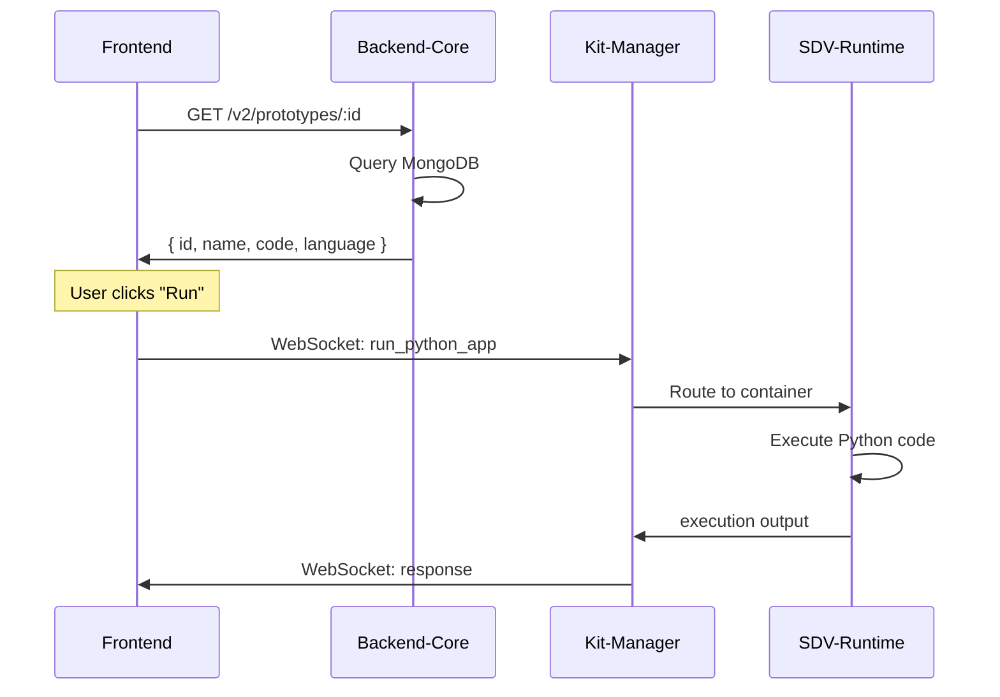
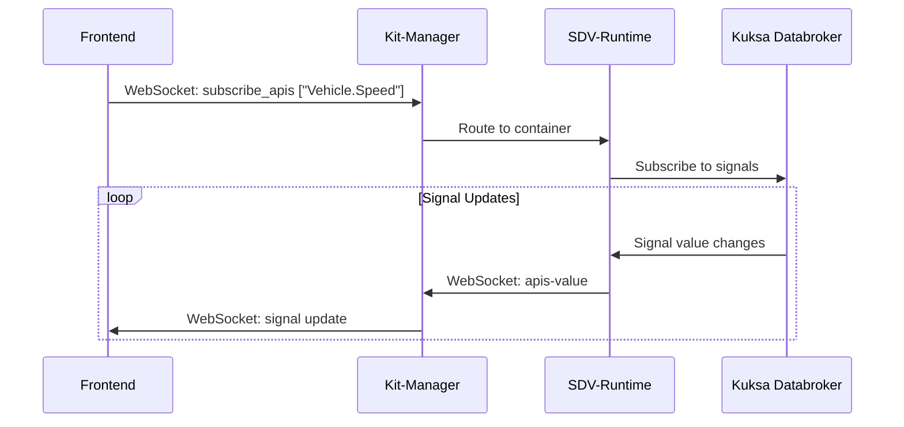
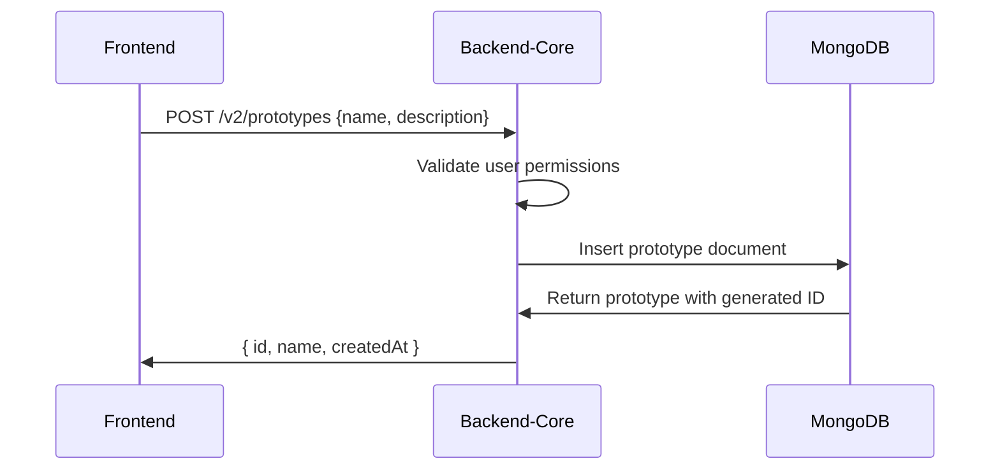

# Eclipse Autowrx Architecture Overview

## System Architecture

```
Frontend (autowrx)    Backend-Core (HTTP REST API)    Kit-Manager (Local/Cloud)    SDV-Runtime (Docker)
      |                        |                              |                           |
      |--- HTTP REST --------->|                              |                           |
      |<-- JSON Response ------|                              |                           |
      |                        |                              |                           |
      |--- WebSocket --------->|----(or direct)------------->|                           |
      |                        |                              |--- Command Forward --->|
      |                        |                              |                           |
      |<-- Real-time data ----|<---------------------------|<--- Execution Results <-|
      |                        |                              |                           |
      |                        |                              |--- Kuksa Databroker <---|
      |                        |                              |   - VSS Signals          |
      |                        |                              |   - Vehicle Model       |
      |                        |                              |   - Code Execution      |
```

## Component Responsibilities

### 1. Frontend (React Application)
**Location**: `./autowrx/`

**Technologies**:
- React 18+ with TypeScript
- Socket.IO Client (`socket.io-client`)
- Axios for HTTP requests
- Zustand for state management
- Tailwind CSS for styling

**Primary Responsibilities**:
- **User Interface**: Code editor, dashboards, prototype management
- **Client-Side Logic**: Business logic, user interactions, data visualization
- **WebSocket Client**: Real-time communication with runtime environments
- **HTTP Client**: REST API calls for data operations

**Key Configuration** (src/configs/config.ts):
```typescript
const config = {
  serverBaseUrl: 'https://backend-core-dev.digital.auto',  // Backend-Core URL
  runtime: {
    url: 'https://kit.digitalauto.tech',                    // Kit-Manager URL
  },
  serverVersion: 'v2',
}
```

### 2. Backend-Core (Node.js API Server)
**Location**: `../backend-core/`

**Technologies**:
- Node.js with Express.js
- Socket.IO Server
- MongoDB database
- JWT authentication
- Docker containerization

**Primary Responsibilities**:
- **HTTP REST API**: Data persistence, user management, model/prototype CRUD
- **WebSocket Proxy**: Routes real-time commands to Kit-Manager
- **Authentication**: JWT token verification and authorization
- **Business Logic**: Server-side validation, data processing

**API Endpoints Structure**:
```
GET    /v2/models                    - List vehicle models
GET    /v2/models/:id                - Get specific model
POST   /v2/prototypes                - Create new prototype
GET    /v2/prototypes/:id            - Get prototype details
PUT    /v2/prototypes/:id            - Update prototype
GET    /v2/apis/model_id/:model_id   - Get vehicle APIs for model
GET    /v2/users/profile             - Get user profile
POST   /v2/auth/login                - User authentication
```

### 3. Kit-Manager (Runtime Management Server)
**Location**: `../sdv-runtime/Kit-Manager/`
**Default Port**: 3090
**Environment Variable**: `SYNCER_SERVER_URL` (defaults to `https://kit.digitalauto.tech`)

**Technologies**:
- Node.js with Express.js
- Socket.IO Server
- In-memory Maps for state management

**Primary Responsibilities**:
- **WebSocket Hub**: Central message routing between frontend and runtimes
- **Runtime Registry**: Manages connected SDV-Runtime instances
- **Client Registry**: Manages connected frontend clients
- **Message Routing**: Routes commands from clients to appropriate runtimes
- **Code Conversion**: Converts prototype code to vehicle app format

**API Endpoints**:
```
GET  /listAllKits          - List all connected runtime kits
GET  /listAllClient        - List all connected clients
POST /convertCode          - Convert prototype code to vehicle app
```

**WebSocket Events**:
```javascript
// Client Registration
socket.on('register_client', payload)
socket.on('unregister_client', payload)

// Kit Registration
socket.on('register_kit', payload)
socket.on('register_hw_kit', payload)

// Message Routing
socket.on('messageToKit', payload)           // Client to Kit
socket.on('messageToKit-kitReply', payload)  // Kit to Client response
socket.on('broadcastToClient', payload)      // Kit broadcasts to clients
```

### 4. SDV-Runtime (Vehicle Runtime Container)
**Location**: `../sdv-runtime/`
**Runtime**: Docker container (multi-architecture: amd64, arm64)
**Components**:

**Core Technologies**:
- **Kuksa Databroker** (0.4.4): Vehicle signal management
- **Vehicle Signal Specification** (4.0): Standardized vehicle data model
- **Vehicle Model Generator** (0.7.2): Generate vehicle models from VSS
- **Velocitas Python SDK** (0.14.1): Vehicle app development framework
- **Python 3.10**: Code execution environment

**Container Components**:
- **kuksa-syncer/**: Synchronizes with Kit-Manager server
- **Kit-Manager/**: Runtime management server
- **vehicle-model-generator/**: Generates vehicle models
- **vehicle_signal_specification/**: VSS data management
- **mock/**: Mock vehicle data providers

**Primary Responsibilities**:
- **Code Execution**: Python, Rust, C++ vehicle app execution
- **Vehicle Simulation**: Real-time vehicle signal simulation
- **VSS Management**: Vehicle Signal Specification data model
- **Signal Mocking**: Mock vehicle data for testing
- **Runtime Isolation**: Containerized execution environments

**Docker Deployment**:
```bash
# Public cloud runtime
docker run -d -e RUNTIME_NAME="MyRuntime" ghcr.io/eclipse-autowrx/sdv-runtime:latest

# Local development with custom Kit-Manager
docker run -d \
  -e RUNTIME_NAME="LocalRuntime" \
  -e SYNCER_SERVER_URL="http://localhost:3090" \
  -p 3090:3090 \
  ghcr.io/eclipse-autowrx/sdv-runtime:latest
```

## Communication Patterns

### HTTP REST API Communication
**Flow**: Frontend ↔ Backend-Core

```typescript
// Frontend HTTP Client Configuration
const serverAxios = axios.create({
  baseURL: `${config.serverBaseUrl}/${config.serverVersion}`, // https://backend-core-dev.digital.auto/v2
  withCredentials: true,
})

// Automatic JWT token injection
serverAxios.interceptors.request.use((config) => {
  const token = useAuthStore.getState().access?.token
  if (token) {
    config.headers.Authorization = `Bearer ${token}`
  }
  return config
})
```

**Example API Calls**:
```typescript
// Get vehicle model details
const model = await serverAxios.get(`/models/${modelId}`)

// Get prototype details
const prototype = await serverAxios.get(`/prototypes/${prototypeId}`)

// Update prototype code
await serverAxios.patch(`/prototypes/${prototypeId}`, { code: newCode })
```

### WebSocket Communication
**Flow**: Frontend ↔ Kit-Manager ↔ SDV-Runtime

**Option 1: Direct to Kit-Manager (Default)**
```typescript
// Frontend connects directly to Kit-Manager
const socketio = io('https://kit.digitalauto.tech', {
  query: { access_token: user.token },
  transports: ['websocket'],
})

// Listen for runtime events
socketio.on('messageToKit-kitReply', (payload) => {
  handleRuntimeResponse(payload)
})
```

**Option 2: Through Backend-Core Proxy**
```typescript
// Frontend connects to Backend-Core, which proxies to Kit-Manager
const socketio = io(config.serverBaseUrl, {
  query: { access_token: user.token },
  transports: ['websocket'],
})
```

**Message Routing**:
1. Frontend sends WebSocket message to Kit-Manager
2. Kit-Manager routes to specific SDV-Runtime container
3. SDV-Runtime executes code in container
4. Results flow back through Kit-Manager

**Configuration** (Frontend):
```typescript
// autowrx/src/configs/config.ts
const config = {
  runtime: {
    // Can be local Kit-Manager or cloud service
    url: import.meta.env.VITE_KIT_SERVER_URL || 'https://kit.digitalauto.tech',
  },
}
```

**Configuration** (SDV-Runtime):
```bash
# Environment variable for Kit-Manager URL
SYNCER_SERVER_URL=https://kit.digitalauto.tech

# Local development
SYNCER_SERVER_URL=http://localhost:3090
```

## Data Flow Examples

### 1. Loading Prototype Code


### 2. Real-time Vehicle Signals


### 3. Prototype Creation


## Complete WebSocket API Specification

### Component Mapping

| Component | Repository Path | Primary Role | Key Files |
|-----------|-----------------|--------------|-----------|
| **Frontend** | `./autowrx/` | WebSocket Client | `src/components/molecules/DaRuntimeConnector.tsx`, `src/services/socketio.service.ts` |
| **Kit-Manager** | `../sdv-runtime/Kit-Manager/` | WebSocket Server/Router | `src/index.js`, `configs.js` |
| **SDV-Runtime** | `../sdv-runtime/kuksa-syncer/` | Runtime Container | `syncer.py`, `vehicle_model_manager.py` |
| **Backend-Core** | `../backend-core/` | HTTP API Server | `src/app.js`, `src/config/socket.js` |

### Message Protocol
All messages follow JSON format:
```json
{
    "cmd": "command_name",
    "to_kit_id": "runtime_identifier",
    "data": { /* command-specific payload */ }
}
```

## Runtime Management Commands

### list-all-kits
**Frontend Send** (`./autowrx/src/components/molecules/DaRuntimeConnector.tsx:374`):
```json
{
    "cmd": "list-all-kits"
}
```

**Kit-Manager Receive** (`../sdv-runtime/Kit-Manager/src/index.js:182`):
```javascript
socket.on('list-all-kits', () => {
    socket.emit('list-all-kits-result', Array.from(KITS.values()))
})
```

**Kit-Manager Send**:
```json
{
    "cmd": "list-all-kits-result",
    "data": [
        {
            "kit_id": "runtime-123",
            "name": "Runtime Name",
            "is_online": true,
            "last_seen": 1640995200,
            "socket_id": "socket_identifier",
            "noRunner": 0,
            "noSubscriber": 0,
            "support_apis": [],
            "desc": "Runtime description"
        }
    ]
}
```

**Frontend Receive** (`./autowrx/src/components/molecules/DaRuntimeConnector.tsx:337`):
```typescript
socketio.on('list-all-kits-result', onGetAllKitData)
```

### register_client / unregister_client
**Frontend Send** (`./autowrx/src/components/molecules/DaRuntimeConnector.tsx:385`):
```json
{
    "cmd": "register_client",
    "username": "test",
    "user_id": "test",
    "domain": "domain"
}
```

**Kit-Manager Receive** (`../sdv-runtime/Kit-Manager/src/index.js:151`):
```javascript
socket.on('register_client', (payload) => {
    CLIENTS.set(socket.id, {
        username: payload.username,
        user_id: payload.user_id,
        domain: payload.domain,
        last_seen: new Date().getTime(),
        is_online: true,
    })
    socket.emit('list-all-kits-result', Array.from(KITS.values()))
})
```

### messageToKit (Command Routing)
**Frontend Send** (`./autowrx/src/components/molecules/DaRuntimeConnector.tsx:140`):
```json
{
    "cmd": "subscribe_apis",
    "to_kit_id": "runtime-123",
    "apis": ["Vehicle.Speed", "Engine.RPM"]
}
```

**Kit-Manager Receive** (`../sdv-runtime/Kit-Manager/src/index.js:216`):
```javascript
socket.on('messageToKit', async (payload) => {
    if(!payload || !payload.cmd || !payload.to_kit_id) return;
    let kit = KITS.get(payload.to_kit_id)
    if(kit) {
        io.to(kit.socket_id).emit('messageToKit', {
            request_from: socket.id,
            ...payload
        })
    }
})
```

**SDV-Runtime Receive** (`../sdv-runtime/kuksa-syncer/syncer.py`):
```python
@sio.event
async def messageToKit(data):
    cmd = data.get('cmd')
    if cmd == 'subscribe_apis':
        # Handle API subscription
        pass
```

## Code Execution Commands

### run_python_app
**Frontend Send** (`./autowrx/src/components/molecules/DaRuntimeConnector.tsx:177`):
```json
{
    "cmd": "run_python_app",
    "to_kit_id": "runtime-123",
    "usedAPIs": ["Vehicle.Speed"],
    "data": {
        "language": "python",
        "watch_vars": "counter",
        "code": "print('Hello')\nvehicle_speed = get('Vehicle.Speed')",
        "name": "MyPrototype"
    }
}
```

**SDV-Runtime Receive** (`../sdv-runtime/kuksa-syncer/syncer.py`):
```python
@sio.event
async def messageToKit(data):
    cmd = data.get('cmd')
    if cmd == 'run_python_app':
        # Execute Python code in container
        # Uses subprocess to run Python with Velocitas SDK
        pass
```

**SDV-Runtime Send**:
```json
{
    "cmd": "run_python_app",
    "result": "Hello\nVehicle Speed: 55.2",
    "isDone": true,
    "code": 0,
    "kit_id": "runtime-123"
}
```

### run_rust_app
**Frontend Send**:
```json
{
    "cmd": "run_rust_app",
    "to_kit_id": "runtime-123",
    "usedAPIs": ["Vehicle.Speed"],
    "data": {
        "language": "rust",
        "code": "fn main() { println!(\"Hello\"); }",
        "name": "RustPrototype"
    }
}
```

### run_cpp_app
**Frontend Send**:
```json
{
    "cmd": "run_cpp_app",
    "to_kit_id": "runtime-123",
    "usedAPIs": ["Vehicle.Speed"],
    "data": {
        "language": "cpp",
        "code": "#include <iostream>\nint main() { std::cout << \"Hello\" << std::endl; return 0; }",
        "name": "CppPrototype"
    }
}
```

### deploy_request
**Frontend Send** (`./autowrx/src/components/molecules/DaRuntimeConnector.tsx:215`):
```json
{
    "cmd": "deploy_request",
    "to_kit_id": "runtime-123",
    "disable_code_convert": true,
    "code": "def main():\n    print('Deployed app')",
    "prototype": {
        "name": "MyPrototype",
        "id": "prototype_id_123"
    },
    "username": "user_name"
}
```

**Kit-Manager Code Conversion** (`../sdv-runtime/Kit-Manager/src/index.js:220`):
```javascript
if(["deploy_request", "deploy_n_run"].includes(payload.cmd)) {
    let convertedCode = ''
    if(payload.disable_code_convert) {
        convertedCode = payload.code
    } else {
        convertedCode = await convertPgCode(payload.prototype?.name || 'App', payload.code || '')
    }
    io.to(kit.socket_id).emit('messageToKit', {
        request_from: socket.id,
        ...payload,
        convertedCode: convertedCode
    })
}
```

## Vehicle Signal Management

### subscribe_apis
**Frontend Send** (`./autowrx/src/components/molecules/DaRuntimeConnector.tsx:140`):
```json
{
    "cmd": "subscribe_apis",
    "to_kit_id": "runtime-123",
    "apis": ["Vehicle.Speed", "Engine.RPM"]
}
```

**SDV-Runtime Real-time Updates**:
```json
{
    "cmd": "apis-value",
    "kit_id": "runtime-123",
    "result": {
        "Vehicle.Speed": 55.2,
        "Engine.RPM": 2500
    }
}
```

### write_signals_value
**Frontend Send** (`./autowrx/src/components/molecules/DaRuntimeConnector.tsx:287`):
```json
{
    "cmd": "write_signals_value",
    "to_kit_id": "runtime-123",
    "data": {
        "Vehicle.Speed": 60.0,
        "Engine.RPM": 3000
    }
}
```

**SDV-Runtime Kuksa Integration** (`../sdv-runtime/kuksa-syncer/syncer.py`):
```python
async def write_signals_value(data):
    client = VSSClient(BORKER_IP, BROKER_PORT)
    async with client as conn:
        for signal_name, value in data.items():
            await conn.set_current_values({
                signal_name: Datapoint(value)
            })
```

### set_vars_value / trace_vars
**Frontend Send**:
```json
{
    "cmd": "set_vars_value",
    "to_kit_id": "runtime-123",
    "data": {
        "counter": "42",
        "status": "active"
    }
}
```

**SDV-Runtime Variable Updates**:
```json
{
    "cmd": "trace_vars",
    "data": {
        "counter": "42",
        "status": "active"
    }
}
```

## Vehicle Model Management

### generate_vehicle_model
**Frontend Send** (`./autowrx/src/components/molecules/DaRuntimeConnector.tsx:261`):
```json
{
    "cmd": "generate_vehicle_model",
    "to_kit_id": "runtime-123",
    "data": "{\"Vehicle\": {\"Speed\": {\"datatype\": \"float\"}}}"
}
```

**SDV-Runtime Processing** (`../sdv-runtime/kuksa-syncer/vehicle_model_manager.py`):
```python
async def generate_vehicle_model(vss_json: str):
    # Use vehicle-model-generator to create VSS model
    # Generate Python code for Velocitas SDK
    pass
```

### revert_vehicle_model
**Frontend Send**:
```json
{
    "cmd": "revert_vehicle_model",
    "to_kit_id": "runtime-123",
    "data": ""
}
```

## Mock Data Management

### list_mock_signal
**Frontend Send** (`./autowrx/src/components/molecules/DaRuntimeConnector.tsx:295`):
```json
{
    "cmd": "list_mock_signal",
    "to_kit_id": "runtime-123"
}
```

**SDV-Runtime Response**:
```json
{
    "cmd": "list_mock_signal",
    "data": [
        {
            "name": "Vehicle.Speed",
            "value": 55.2,
            "type": "float",
            "description": "Vehicle speed in km/h"
        }
    ]
}
```

### set_mock_signals
**Frontend Send** (`./autowrx/src/components/molecules/DaRuntimeConnector.tsx:269`):
```json
{
    "cmd": "set_mock_signals",
    "to_kit_id": "runtime-123",
    "data": [
        {
            "name": "Vehicle.Speed",
            "value": 60.0,
            "type": "float"
        }
    ]
}
```

## Package Management

### list_python_packages
**Frontend Send** (`./autowrx/src/components/molecules/DaRuntimeConnector.tsx:231`):
```json
{
    "cmd": "list_python_packages",
    "to_kit_id": "runtime-123"
}
```

**SDV-Runtime Response**:
```json
{
    "cmd": "list_python_packages",
    "kit_id": "runtime-123",
    "data": "numpy==1.21.0\npandas==1.3.0\nrequests==2.25.1"
}
```

### install_python_packages
**Frontend Send** (`./autowrx/src/components/molecules/DaRuntimeConnector.tsx:241`):
```json
{
    "cmd": "install_python_packages",
    "to_kit_id": "runtime-123",
    "data": "numpy==1.21.0 pandas==1.3.0"
}
```

**SDV-Runtime Package Management** (`../sdv-runtime/kuksa-syncer/pkg_manager.py`):
```python
async def install_package(package_name: str):
    # Use pip to install Python packages in container
    subprocess.run(['pip', 'install', package_name])
```

## Runtime Information Commands

### get-runtime-info
**Frontend Send** (`./autowrx/src/components/molecules/DaRuntimeConnector.tsx:302`):
```json
{
    "cmd": "get-runtime-info",
    "to_kit_id": "runtime-123"
}
```

**SDV-Runtime Response**:
```json
{
    "cmd": "get-runtime-info",
    "kit_id": "runtime-123",
    "data": {
        "lsOfRunner": [
            {
                "appName": "prototype_name",
                "request_from": "client_socket_id",
                "from": 1640995200
            }
        ],
        "lsOfApiSubscriber": {
            "subscriber_id": {
                "apis": ["Vehicle.Speed", "Engine.RPM"],
                "from": 1640995200
            }
        }
    }
}
```

### report-runtime-state
**SDV-Runtime Send**:
```json
{
    "cmd": "report-runtime-state",
    "kit_id": "runtime-123",
    "data": {
        "noOfRunner": 2,
        "noSubscriber": 1,
        "lsOfRunner": [...],
        "lsOfApiSubscriber": {...}
    }
}
```

## Component-Specific Implementation

### Frontend Implementation (`./autowrx/`)

**Socket Connection Setup** (`src/services/socketio.service.ts:14`):
```typescript
import { io } from 'socket.io-client'
const URL = config?.runtime?.url || 'https://kit.digitalauto.tech'
export const socketio = io(URL)
```

**Runtime Connector** (`src/components/molecules/DaRuntimeConnector.tsx`):
```typescript
// Registers client and manages runtime selection
socketio.emit('register_client', {
    username: 'test',
    user_id: 'test',
    domain: 'domain'
})

// Routes commands to specific runtimes
socketio.emit('messageToKit', {
    cmd: 'run_python_app',
    to_kit_id: activeRtId,
    data: { /* code and parameters */ }
})
```

**State Management** (`src/stores/socketStore.ts`):
```typescript
const getSocketIO = (url: string, accessToken?: string) => {
    const socket = io(url, {
        query: { access_token: accessToken },
        transports: ['websocket'],
    })
    return socket
}
```

### Kit-Manager Implementation (`../sdv-runtime/Kit-Manager/`)

**Server Setup** (`src/index.js:22`):
```javascript
const io = new Server(server, {
    maxHttpBufferSize: 1e8,
    cors: { origin: '*' }
})
```

**Runtime Registry** (`src/index.js:29`):
```javascript
let KITS = new Map()  // Connected SDV-Runtime containers
let CLIENTS = new Map()  // Connected frontend clients

socket.on('register_kit', (payload) => {
    KITS.set(payload.kit_id, {
        socket_id: socket.id,
        kit_id: payload.kit_id,
        name: payload.name || '',
        is_online: true,
        noRunner: 0,
        support_apis: payload.support_apis || []
    })
})
```

**Message Routing** (`src/index.js:216`):
```javascript
socket.on('messageToKit', async (payload) => {
    let kit = KITS.get(payload.to_kit_id)
    if(kit) {
        io.to(kit.socket_id).emit('messageToKit', {
            request_from: socket.id,
            ...payload
        })
    }
})
```

### SDV-Runtime Implementation (`../sdv-runtime/`)

**Container Components**:
- **Kuksa Databroker**: Vehicle signal management on port 55555
- **kuksa-syncer**: Python client connecting to Kit-Manager
- **vehicle-model-generator**: VSS to vehicle model conversion
- **Mock Providers**: Vehicle signal simulation

**Syncer Connection** (`kuksa-syncer/syncer.py:48`):
```python
sio = socketio.AsyncClient()
await sio.connect(SYNCER_SERVER_URL)

await sio.emit('register_kit', {
    'kit_id': runtime_name,
    'name': runtime_name,
    'support_apis': []
})
```

## Error Handling

### Frontend Error Handling
```typescript
socketio.on('connect_error', (error) => {
    console.error('WebSocket connection failed:', error)
})

socketio.on('disconnect', (reason) => {
    console.warn('WebSocket disconnected:', reason)
})
```

### Kit-Manager Error Handling
```javascript
socket.on('error', (error) => {
    console.error('Socket error:', error)
    // Clean up disconnected clients/kits
})
```

### SDV-Runtime Error Handling
```python
try:
    # Execute code or process commands
    pass
except Exception as e:
    await sio.emit('messageToKit-kitReply', {
        'cmd': cmd,
        'error': str(e),
        'isDone': True,
        'code': 1
    })
```

## Extending the API

### Adding New HTTP Endpoints

1. **Backend-Core Routes** (`../backend-core/src/routes/`):
```javascript
// backend-core/src/routes/prototype.routes.js
router.get('/:prototypeId/execution-history', prototypeController.getExecutionHistory);
```

2. **Backend-Core Controller** (`../backend-core/src/controllers/`):
```javascript
const getExecutionHistory = catchAsync(async (req, res) => {
  const { prototypeId } = req.params;
  const history = await executionService.getHistory(prototypeId);
  res.send(history);
});
```

3. **Frontend Service** (`./autowrx/src/services/`):
```typescript
export const getExecutionHistoryService = async (prototypeId: string) => {
  return (await serverAxios.get<ExecutionHistory[]>(`/prototypes/${prototypeId}/execution-history`)).data
}
```

4. **Frontend Hook** (`./autowrx/src/hooks/`):
```typescript
export const useExecutionHistory = (prototypeId: string) => {
  return useQuery({
    queryKey: ['execution-history', prototypeId],
    queryFn: () => getExecutionHistoryService(prototypeId),
  })
}
```

### Adding New WebSocket Commands

1. **Frontend Runtime Connector** (`./autowrx/src/components/molecules/DaRuntimeConnector.tsx`):
```typescript
const deployToCloud = (deploymentConfig: any) => {
  socketio.emit('messageToKit', {
    cmd: 'deploy_to_cloud',
    to_kit_id: activeRtId,
    data: deploymentConfig,
  })
}

useImperativeHandle(ref, () => ({
  // ... existing methods
  deployToCloud,
}))
```

2. **Handle Response**:
```typescript
const onKitReply = (payload: any) => {
  if (payload.cmd == 'deploy_to_cloud') {
    if (onDeployResponse) {
      onDeployResponse(payload.result, payload.is_finish)
    }
  }
  // ... existing handlers
}
```

3. **Kit-Manager Routing** (`../sdv-runtime/Kit-Manager/src/index.js`):
```javascript
socket.on('messageToKit', async (payload) => {
    if(payload.cmd == 'deploy_to_cloud') {
        // Handle deploy_to_cloud specifically
        // Convert code or forward as-is
    }
    // ... existing routing logic
})
```

4. **SDV-Runtime Handler** (`../sdv-runtime/kuksa-syncer/syncer.py`):
```python
@sio.event
async def messageToKit(data):
    cmd = data.get('cmd')
    if cmd == 'deploy_to_cloud':
        # Handle cloud deployment
        pass
    # ... existing command handlers
```

## Security Considerations

### Authentication Flow
1. **Login**: Frontend sends credentials to `/v2/auth/login`
2. **JWT Token**: Backend-core issues access and refresh tokens
3. **HTTP APIs**: Automatic token injection via axios interceptors
4. **WebSocket**: Token passed as query parameter during connection
5. **Token Verification**: Backend-core validates all requests

### CORS Configuration
```javascript
// Kit-Manager CORS
io = new Server(server, {
    cors: { origin: '*' }
})

// Backend-Core CORS
io = new Server(server, {
  cors: {
    origin: '*',
    credentials: true,
  },
});
```

### Data Validation
- **Backend-Core**: Joi validation schemas for all endpoints
- **Frontend**: TypeScript interfaces for type safety
- **Database**: Mongoose schemas for data integrity
- **WebSocket**: Input validation in Kit-Manager

## Development and Debugging

### Local Development Setup
```bash
# 1. Start Backend-Core (HTTP API)
cd ../backend-core
npm install
npm run dev  # Port 8080

# 2. Start Kit-Manager (WebSocket Server)
cd ../sdv-runtime/Kit-Manager
npm install
npm start  # Port 3090

# 3. Start Frontend
cd ./autowrx
npm install
npm run dev  # Port 3000

# 4. Start SDV-Runtime Container
cd ../sdv-runtime
docker build -t sdv-runtime:latest .
docker run -d \
  -e RUNTIME_NAME="LocalRuntime" \
  -e SYNCER_SERVER_URL="http://localhost:3090" \
  -p 55555:55555 \
  sdv-runtime:latest
```

### Environment Configuration
```bash
# autowrx/.env
VITE_SERVER_BASE_URL=http://localhost:8080
VITE_KIT_SERVER_URL=http://localhost:3090

# backend-core/.env
NODE_ENV=development
PORT=8080
MONGODB_URL=mongodb://localhost:27017/autowrx

# Kit-Manager config (configs.js)
const config = { port: 3090 }

# SDV-Runtime Environment
SYNCER_SERVER_URL=http://localhost:3090
RUNTIME_NAME=LocalRuntime
RUNTIME_PREFIX=Runtime-
```

### Adding New Features
1. **Database Schema**: Define in backend-core models
2. **API Endpoints**: Create routes and controllers
3. **Frontend Integration**: Add services and hooks
4. **UI Components**: Create React components
5. **WebSocket**: Add runtime commands if needed
6. **Testing**: Unit and integration tests

### Monitoring and Debugging

**Frontend Debugging**:
- **React DevTools**: Component state and props
- **Network Tab**: HTTP requests and responses
- **WebSocket Console**: Real-time message inspection
- **State Management**: Zustand dev tools

**Backend Debugging**:
- **Morgan**: HTTP request logging
- **Winston**: Application logging
- **MongoDB Logs**: Database operations
- **Socket.IO Debug**: WebSocket connection debugging

**Runtime Monitoring**:
- **WebSocket Events**: Real-time command tracking
- **Execution Logs**: Code execution output
- **Signal Monitoring**: Vehicle signal updates
- **Kuksa Databroker**: VSS signal changes

**Kit-Manager Debugging**:
- Runtime registry state
- Client connection tracking
- Message routing logs
- Error handling and cleanup

This complete architecture provides a comprehensive vehicle software development platform with clear separation of concerns and well-defined communication patterns between all components.