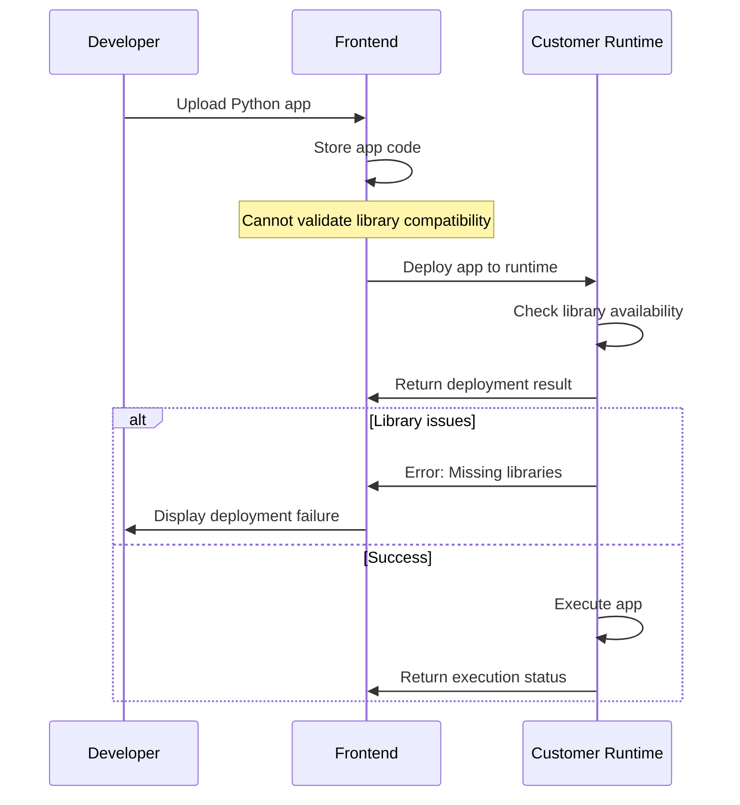

# Vehicle Edge Runtime Integration Requirements (Refined)

## Overview
This document defines requirements for integrating third-party Vehicle Edge Runtime environments with the Eclipse Autowrx platform, based on the simplified approach where applications handle their own vehicle connections and the Vehicle Edge Runtime provides basic execution capabilities with real-time console output feedback.

## 1. Simplified Architecture

### 1.1 Component Replacement
- **Customer Runtime**: Simple command receiver and app executor
- **Application Responsibility**: Handle own vehicle connections and signal wiring
- **Environment**: Preset Docker containers or binary execution
- **Libraries**: Fixed preset libraries in runtime environment

### 1.2 Communication Architecture
```
Frontend → Kit-Manager → Vehicle Edge Runtime → App Container/Binary → Customer Vehicle System
                                              ↓
                                       App handles own VSS wiring
                                              ↓
                                 Real-time stdout → Frontend Console
```

## 2. Reduced Protocol Requirements

### 2.1 Essential WebSocket Commands Only
**Simplified command set - no complex runtime management:**

#### 2.1.1 Core Registration Commands
- `register_kit` - Runtime registration with capabilities
- `register_client` - Client registration
- `list-all-kits` - Runtime discovery

#### 2.1.2 Simplified Execution Commands
- `run_python_app` - Execute Python app in preset Docker environment
- `run_binary_app` - Execute pre-compiled binary on device
- `stop_app` - Terminate running application
- `get_app_status` - Check application execution status

#### 2.1.3 Real-time Output Commands
- `app_output` - Stream application stdout/stderr to frontend in real-time
- `app_log` - Application log streaming and buffering
- `console_subscribe` - Subscribe to application console output
- `console_unsubscribe` - Unsubscribe from application console output

#### 2.1.4 Basic Status Reporting
- `messageToKit-kitReply` - Execution results and status
- `report-runtime-state` - Basic runtime status (apps running, resource usage)

### 2.2 Commands NOT Required
The following complex commands can be **omitted**:
- ~~`run_rust_app`~~ (apps handle their own compilation)
- ~~`run_cpp_app`~~ (apps handle their own compilation)
- ~~`subscribe_apis`~~ (apps handle their own signal subscriptions)
- ~~`write_signals_value`~~ (apps handle their own signal writing)
- ~~`apis-value`~~ (apps provide their own signal updates)
- ~~`set_vars_value` / `trace_vars`~~ (app-level variable management)
- ~~`generate_vehicle_model`~~ (apps handle their own VSS)
- ~~`revert_vehicle_model`~~ (apps handle their own VSS)
- ~~`list_mock_signal` / `set_mock_signals`~~ (apps handle their own mocking)
- ~~`list_python_packages` / `install_python_packages`~~ (fixed preset libraries)
- ~~`get-runtime-info`~~ (simplified status only)

## 3. Application Execution Requirements

### 3.1 Execution Environment Support
**Customer runtime must support two execution modes:**

#### 3.1.1 Docker Python Execution
```json
{
    "cmd": "run_python_app",
    "to_kit_id": "customer-runtime-001",
    "data": {
        "code": "import customer_vehicle_sdk\n# App handles own vehicle connections",
        "app_config": {
            "vehicle_credentials": "provided_by_runtime",
            "vss_endpoint": "customer_vehicle_system_endpoint"
        }
    }
}
```

#### 3.1.2 Binary Execution
```json
{
    "cmd": "run_binary_app",
    "to_kit_id": "customer-runtime-001",
    "data": {
        "binary_url": "https://customer-cdn.com/app-binary",
        "execution_args": ["--vehicle-config", "/etc/vehicle.json"],
        "environment": {
            "VEHICLE_ENDPOINT": "customer.vehicle.system",
            "AUTH_TOKEN": "runtime_provided_token"
        }
    }
}
```

### 3.2 Preset Environment Requirements
- **Docker Images**: Pre-configured with customer vehicle libraries
- **Runtime Libraries**: Fixed set of customer-specific vehicle SDKs
- **Environment Variables**: Runtime injects vehicle connection parameters
- **Resource Limits**: Predefined CPU/memory constraints

### 3.3 Application Independence
**Applications are responsible for:**
- Vehicle signal subscription and handling
- Custom VSS implementation
- Vehicle system authentication
- Error handling and recovery
- Data persistence if needed

## 4. Minimal Vehicle Integration Requirements

### 4.1 Runtime Vehicle Access
**Customer runtime must provide applications with:**
- Vehicle system access credentials/tokens
- Vehicle system endpoint URLs
- Authentication mechanisms
- Network access permissions

### 4.2 Runtime Vehicle Configuration
**Runtime injects vehicle configuration into app environment:**
```json
{
    "vehicle_config": {
        "endpoint": "https://customer.vehicle.api",
        "authentication": {
            "type": "token",
            "token": "runtime_generated_token"
        },
        "signal_mapping": {
            "standard_vss": "customer_signal_format"
        }
    }
}
```

## 5. Simplified Status and Monitoring

### 5.1 Basic Runtime Status
**Customer runtime must report:**
```json
{
    "cmd": "report-runtime-state",
    "kit_id": "customer-runtime-001",
    "data": {
        "running_apps": [
            {
                "app_id": "prototype_123",
                "status": "running",
                "start_time": 1640995200,
                "resource_usage": {
                    "cpu": "15%",
                    "memory": "256MB"
                }
            }
        ],
        "total_apps": 3,
        "runtime_status": "healthy"
    }
}
```

### 5.2 Execution Results
**Simple execution reporting:**
```json
{
    "cmd": "run_python_app",
    "result": "Application started successfully\nVehicle connection established",
    "status": "running",
    "app_id": "app_12345",
    "logs": "Application logs here..."
}
```

## 6. Application Deployment Requirements

### 6.1 Code Deployment (Python)
**Runtime must support:**
- Code injection into preset Python Docker environment
- Vehicle credential injection
- Application configuration injection
- Basic execution monitoring

### 6.2 Binary Deployment
**Runtime must support:**
- Binary download from customer CDN/repository
- Secure binary verification
- Environment variable injection
- Process monitoring and logging

## 7. Frontend Compatibility (Simplified)

### 7.1 Required Frontend Changes
**Minimal frontend modifications needed:**
- Remove references to unsupported commands
- Update runtime connector to handle simplified execution
- Modify signal handling (apps provide their own UI for signals)
- Update deployment workflows for binary support

### 7.2 Application Development Workflow
**Developers must:**
- Include customer vehicle SDK in their applications
- Handle own vehicle signal subscriptions
- Implement own UI for vehicle data if needed
- Use preset vehicle connection libraries

## 8. Customer Runtime Implementation

### 8.1 Minimal Runtime Requirements
**Customer must implement:**
```python
class CustomerRuntime:
    def __init__(self):
        self.vehicle_system = CustomerVehicleSystem()
        self.docker_manager = DockerManager()
        self.binary_executor = BinaryExecutor()

    async def handle_run_python_app(self, data):
        # Inject vehicle credentials into environment
        env_vars = {
            'VEHICLE_TOKEN': self.vehicle_system.generate_token(),
            'VEHICLE_ENDPOINT': self.vehicle_system.get_endpoint()
        }

        # Execute in preset Docker with customer libraries
        result = await self.docker_manager.run_python(
            code=data['code'],
            environment=env_vars,
            preset_image='customer/python-runtime:latest'
        )
        return result

    async def handle_run_binary_app(self, data):
        # Download and execute binary with vehicle credentials
        binary_path = await self.download_binary(data['binary_url'])
        env_vars = {
            'VEHICLE_TOKEN': self.vehicle_system.generate_token(),
            'VEHICLE_ENDPOINT': self.vehicle_system.get_endpoint()
        }

        result = await self.binary_executor.run(
            binary_path,
            args=data['execution_args'],
            environment=env_vars
        )
        return result
```

## 9. Simplified Success Criteria

### 9.1 Functional Success
✅ Python apps run in preset Docker environment
✅ Binary apps execute on customer device
✅ Apps receive vehicle credentials for system access
✅ Basic status reporting works
✅ Minimal frontend changes required

### 9.2 Technical Success
✅ WebSocket protocol implemented for core commands
✅ Vehicle credential injection works
✅ Application isolation and resource management
✅ Basic monitoring and logging

### 9.3 Business Success
✅ Customer uses their vehicle system with standard apps
✅ Developers use customer vehicle SDKs
✅ Reduced implementation complexity for customer
✅ Faster integration timeline

## 10. Implementation Phases

### Phase 1: Core Runtime (Week 1-2)
- Implement WebSocket server with basic commands
- Create preset Python Docker environment
- Implement binary execution
- Add basic status reporting

### Phase 2: Vehicle Integration (Week 2-3)
- Integrate customer vehicle authentication
- Implement credential injection
- Add vehicle configuration management
- Test with sample applications

### Phase 3: Frontend Integration (Week 3-4)
- Update frontend for simplified commands
- Remove unsupported features
- Test compatibility with existing prototypes
- Documentation and training

## 10. Real-time Console Output Requirements

### 10.1 Console Output Architecture
**Vehicle Edge Runtime must provide:**
- Real-time stdout/stderr streaming from applications
- Buffered output for application lifecycle events
- WebSocket-based console output delivery
- Output buffering during connection interruptions
- Multi-application console output management

### 10.2 Console Output Protocol
**Runtime must implement console output streaming:**
```json
{
    "cmd": "app_output",
    "app_id": "vehicle_monitor_001",
    "output_type": "stdout",
    "timestamp": 1640995200,
    "content": "Vehicle speed: 55.2 km/h\nEngine RPM: 2500"
}
```

### 10.3 Console Output Management
**Console output requirements:**
- **Real-time streaming**: Output appears instantly in frontend console
- **Output buffering**: Maintain output history during disconnections
- **Multi-app support**: Handle console output from multiple running applications
- **Output filtering**: Allow filtering by app_id, output_type (stdout/stderr), or content
- **History retention**: Store console output for debugging and review

### 10.4 Enhanced Execution Results
**Execution reporting with console integration:**
```json
{
    "cmd": "run_python_app",
    "result": "Application started successfully\nVehicle connection established",
    "status": "running",
    "app_id": "app_12345",
    "console_streaming": true,
    "console_endpoint": "/console/app_12345"
}
```

## 11. Frontend Limitations and Library Requirements

### 11.1 Frontend Scope Limitations
**Frontend capabilities are limited to:**
- **Code hosting**: Store and manage Python application files
- **App deployment**: Send applications to customer runtime
- **Basic configuration**: App metadata and deployment settings
- **Runtime status**: View application execution status

**Frontend cannot:**
- Check vehicle signal library compatibility on customer device
- Validate Python library requirements against runtime environment
- Verify vehicle signal SDK versions
- Test application compatibility before deployment

### 10.2 Library Compatibility Management
**Customer runtime responsibilities:**
```json
{
    "runtime_environment": {
        "python_version": "3.10+",
        "vehicle_signal_libraries": [
            {
                "name": "customer-vehicle-sdk",
                "version": "2.1.0",
                "vss_support": "custom_vss_format"
            }
        ],
        "standard_libraries": [
            "requests",
            "json",
            "asyncio",
            "socketio-client"
        ]
    }
}
```

### 10.3 Application Development Guidelines
**Developers must ensure:**
- Use only libraries available in customer runtime environment
- Handle vehicle signal SDK compatibility independently
- Test applications in customer runtime environment
- Include error handling for missing dependencies

### 10.4 Deployment Validation Flow


## 11. Application Persistence and Management Requirements

### 11.1 Persistent Application Storage
**Customer runtime must support:**
- Application persistence across device restarts/reboots
- Automatic application recovery and restart
- Application state preservation
- Configuration and deployment history retention

#### 11.1.1 Application Lifecycle Management
- **Deploy**: Install and configure applications with persistence
- **Start/Stop**: Control application execution with state persistence
- **Restart**: Automatic restart on device boot or crash recovery
- **Update**: Update applications while preserving configuration
- **Remove**: Clean removal with proper cleanup

#### 11.1.2 Storage Requirements
- Application binaries/code storage
- Configuration files and settings
- Runtime state and status information
- Logs and execution history
- Deployment metadata

### 11.2 Multi-Application Management
**Customer runtime must support:**
- Unlimited number of simultaneous deployed applications
- Application isolation and resource management
- Concurrent execution without interference
- Individual application lifecycle control

#### 11.2.1 Application Registry
```json
{
    "deployed_apps": [
        {
            "app_id": "customer_speed_monitor_001",
            "name": "Speed Monitor Application",
            "version": "1.2.0",
            "status": "running",
            "deploy_time": "2025-01-15T10:30:00Z",
            "auto_start": true,
            "resources": {
                "cpu_limit": "20%",
                "memory_limit": "512MB"
            }
        },
        {
            "app_id": "customer_diagnostics_002",
            "name": "Vehicle Diagnostics",
            "version": "2.1.0",
            "status": "stopped",
            "deploy_time": "2025-01-14T15:45:00Z",
            "auto_start": false
        }
    ]
}
```

### 11.3 VSS Signal Conflict Resolution

#### 11.3.1 Central VSS Configuration
**Customer device must provide:**
- Central VSS JSON configuration file access
- Signal definition repository
- Vehicle signal mapping and metadata
- Server endpoint configuration for signal retrieval

#### 11.3.2 Pre-Deployment Conflict Detection
**Runtime must check for conflicts before deployment:**

**Signal Access Conflicts:**
- Signal type mismatches between apps
- Exclusive signal access violations
- Priority conflicts for shared signals

**Note**: Multiple apps are allowed to write to the same signal. Runtime does not need to manage write conflicts as this is handled at the vehicle system level.

#### 11.3.3 Conflict Resolution Strategies

**Signal Access Validation:**
- Validate signal existence against central VSS
- Check signal data type compatibility
- Verify signal access permissions

**Exclusive Signal Access:**
- Configurable exclusive signal ownership
- Priority-based access control
- Prevent unauthorized signal access

**Note**: Runtime allows multiple concurrent writes to the same signal. Signal write conflicts are managed by the underlying vehicle system, not by the runtime.

#### 11.3.4 Deployment Precheck Process
```json
{
    "deployment_precheck": {
        "app_id": "new_app_003",
        "signals_required": [
            {
                "signal": "Vehicle.Speed",
                "access": "read",
                "conflict": false
            },
            {
                "signal": "Vehicle.Brake.PedalPosition",
                "access": "write",
                "conflict": {
                    "conflicting_app": "brake_controller_001",
                    "conflict_type": "exclusive_access_violation",
                    "can_deploy": false
                }
            }
        ],
        "deployment_approved": false,
        "conflicts_found": 1,
        "recommended_actions": [
            "Stop conflicting app with exclusive access",
            "Use different signal with same functionality",
            "Request exclusive access removal from conflicting app"
        ]
    }
}
```

### 11.4 VSS Configuration Management

#### 11.4.1 Central VSS Retrieval
**Runtime must provide:**
```json
{
    "vss_config": {
        "central_vss_url": "https://customer.vehicle.server/vss.json",
        "local_cache": "/etc/vehicle/vss_cached.json",
        "refresh_interval": 3600,
        "fallback_config": "/etc/vehicle/vss_backup.json"
    }
}
```

#### 11.4.2 Signal Validation
- Validate app signal requirements against central VSS
- Check signal data type compatibility
- Verify signal existence and accessibility
- Validate signal access permissions

### 11.5 Enhanced WebSocket Commands

#### 11.5.1 Application Management Commands
```json
{
    "cmd": "deploy_app",
    "data": {
        "app_id": "new_app_003",
        "code": "application code or binary_url",
        "config": {
            "auto_start": true,
            "restart_policy": "on_failure",
            "resource_limits": {
                "cpu": "10%",
                "memory": "256MB"
            }
        }
    }
}

{
    "cmd": "list_deployed_apps",
    "response": {
        "apps": [...],
        "total_count": 5,
        "running_count": 3
    }
}

{
    "cmd": "manage_app",
    "data": {
        "app_id": "existing_app_001",
        "action": "start|stop|restart|update|remove",
        "force": false
    }
}
```

#### 11.5.2 VSS Management Commands
```json
{
    "cmd": "check_signal_conflicts",
    "data": {
        "app_id": "test_app_004",
        "signals": [
            {"signal": "Vehicle.Speed", "access": "read"},
            {"signal": "Vehicle.Engine.RPM", "access": "write"}
        ]
    }
}

{
    "cmd": "get_vss_config",
    "response": {
        "vss_url": "https://customer.vehicle.server/vss.json",
        "last_updated": "2025-01-15T12:00:00Z",
        "signal_count": 1247
    }
}
```

### 11.6 Runtime Storage Requirements

#### 11.6.1 Application Storage Structure
```
/var/lib/customer-runtime/
├── apps/
│   ├── app_001/
│   │   ├── main.py
│   │   ├── config.json
│   │   ├── state.json
│   │   └── logs/
│   ├── app_002/
│   │   ├── binary
│   │   ├── config.json
│   │   └── state.json
├── vss/
│   ├── vss.json (cached)
│   └── vss_backup.json
├── registry/
│   ├── deployed_apps.json
│   └── deployment_history.json
└── system/
    ├── runtime_config.json
    └── signal_permissions.json
```

#### 11.6.2 State Persistence
- Application deployment registry
- Runtime configuration and settings
- VSS configuration cache
- System state and health information
- Deployment history and rollback data

## 12. Out of Scope

### 12.1 Features Not Required
- Real-time signal streaming from runtime
- Package management in runtime
- Mock data management
- Vehicle model generation
- Complex application debugging

### 12.2 Application Responsibilities
**Applications must handle:**
- Vehicle signal subscriptions and updates
- Custom VSS implementation
- Vehicle data presentation
- Error handling and retry logic
- Signal conflict resolution at application level (when runtime allows)
- Configuration persistence for app-specific settings